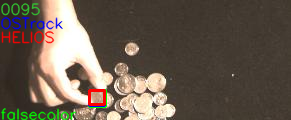
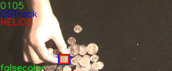
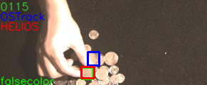
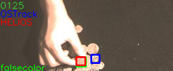
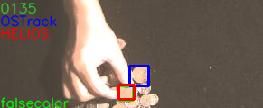
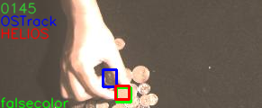
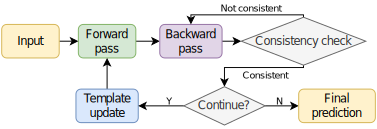
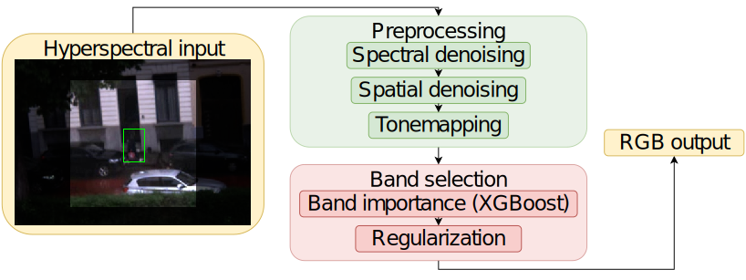

# HELIOS: Hyperspectral Hindsight OSTracker

[Rafał Muszyński](https://orcid.org/0000-0002-1676-8458), [Hiep Luong](https://telin.ugent.be/~hluong/)

[URC](https://urc.ugent.be/) - [IPI](https://ipi.ugent.be/) - [Ghent University](https://www.ugent.be/en), [IMEC](https://www.imec.be/nl)

---

This is the official implementation of the paper: "HELIOS: Hyperspectral Hindsight OSTracker". Our submission achieved the 3rd place in the [Hyperspectral object tracking challenge 2023](https://www.hsitracking.com) which was part of the [13th edition of the WHISPERS conference](https://www.ieee-whispers.com/).

Link to our paper (TBD)

Our project is an extension of OSTrack - "Joint Feature Learning and Relation Modeling for Tracking: A One-Stream Framework": [code](https://github.com/botaoye/OSTrack) [paper](https://arxiv.org/abs/2203.11991) 

|    |    |   |
|-|-|-|
|    | |  |


## Abstract

In this paper we present our video object tracking algorithm HELIOS (HyperspEctraL hIndsight OStracker) designed for snapshot mosaic hyperspectral cameras,
as part of our submission to the Third Hyperspectral Object Tracking Challenge 2023.
HELIOS is based on a high-performance RGB-based one-stream tracking framework for joint feature learning and relational modeling
based on self-attention operators. We further extend this framework to leverage information in the spectral domain through a new band selection algorithm
and in the temporal domain through forward-backward consistency constraints. We obtained an averaged AUC of 0.634 and DP@20 pixels score of 0.846 on the validation dataset,
thereby outperforming several published SOTA hyperspectral object tracking algorithms.

**Forward backward framework:**
<p align="center">
  
</p>

**Band selection framework:**
<p align="center">
  
</p>
  
## Installation

Install python dependencies:
```bash
pip install -r requirements.txt
```

### Install OSTrack
```bash
git submodule init
git submodule update
cd ext/OSTrack 
bash install.sh
pip install thop
mkdir pretrained_models
mkdir -p output/checkpoints/train/ostrack/vitb_384_mae_ce_32x4_ep300
```

Follow the instructions in the repository to download the weights of the pretrained models and put them in the directories created in the previous 2 steps

Configure paths in the project:
```bash
python tracking/create_default_local_file.py --workspace_dir . --data_dir ./data --save_dir ./output
```

The --data_dir isn't important for us

Test the setup by running it on one of the sequences from the hyperspectral object tracking datasets:
```bash
python tracking/video_demo.py ostrack vitb_384_mae_ce_32x4_ep300 <hot 2023 path>/training/HSI-VIS-FalseColor/automobile5 --optional_box 15 174 10 10 --save_results
```

## Running on custom data
Use the `run.py` script to run the HELIOS algorithm on an arbitrary hyperspectral input sequence.

Example usage:
```bash
python run.py /scratch/datasets/hot_2023/validation/HSI-VIS/coin  --init_bbox 96 83 16 16 --camera_type HSI-VIS --scene_name coin
```
See `--help` for more details on script usage.

## Repository contents

**Notebooks:** 
Notebooks contain some of our experiments. Final challenge submission was generated using the `notebooks/11.4_backward_forward-neighbours-dim_reduction.ipynb` file. `notebooks/11.5_final_model_fixed.ipynb` and files in the `src` folder fix a bug we spotted in our implementation after the challange has finished.  

**src:**
`src` directory contains implementation of our paper and helper functions for managing the dataset

**eval_2023.py:**
The `eval_2023.py` script can be used to visualize the model predictions

**run.py:**
Runs the HELIOS algorithm on an arbitrary hyperspectral input sequence.

**outputs:**
Outputs directory contains predictions of our model. Notably, `outputs/model_predictions/forward-backward-neighbours_v1-hsi-xgboost-falsecolor-mix-09-fixed` contains reproduced predictions of our model on the validation dataset.

## Citation

TBD

## License

MIT License
